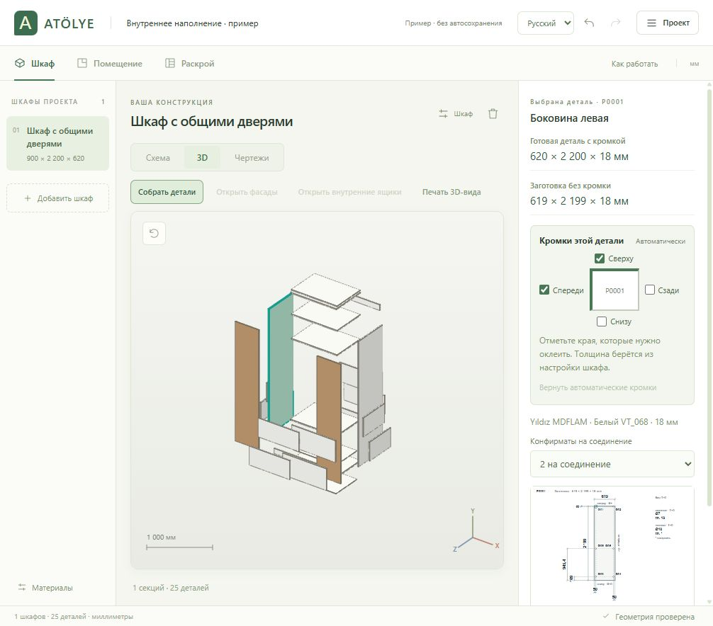
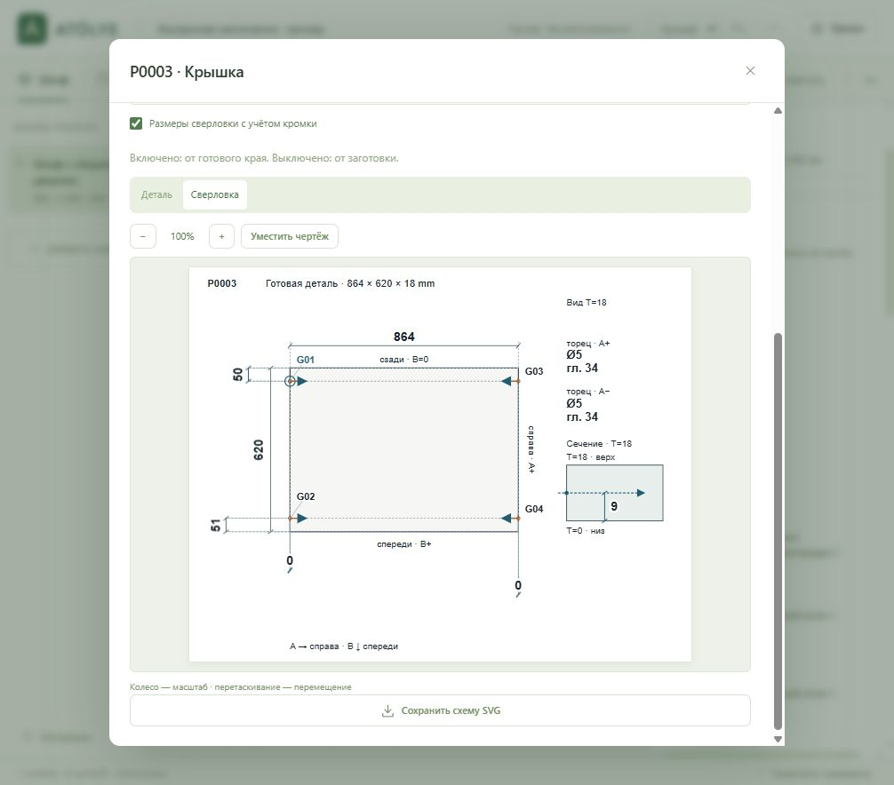

# ATÖLYE — конструктор корпусной мебели

[Русский](README.md) · [Türkçe](README.tr.md) · [English documentation](README.en.md)

Локальная программа с турецким, русским и английским интерфейсом: свободная схема шкафа, помещение любой многоугольной формы, чертежи, детали и листовой раскрой. Все размеры — **в миллиметрах**. Работает в браузере без интернета после запуска. Можно бесплатно использовать, изменять и распространять по [лицензии ATÖLYE](LICENSE.ru.md). Продавать программу и изменённые версии запрещено; использовать её в мебельном бизнесе и продавать свои проекты можно.

## Установка в Windows

Скачайте **ATOLYE-Setup-2.2.1-x64.exe** из [последнего релиза](https://github.com/sky13myth-web/furniture-modeler/releases/latest), запустите его и пройдите обычную установку. Приложение появится на рабочем столе и в меню «Пуск». Node.js, терминал и интернет для работы не нужны. Установка выполняется для текущего пользователя; проекты сохраняются локально. [Подробности установки и резервного копирования](docs/windows-install.md).

## Веб-версия через Cloudflare Pages

Если в Cloudflare при подключении GitHub есть поле **Deploy command**, создано приложение **Workers**. Оно также поддерживается: имя `furniture-modeler`, ветка `main`, **Build command** — `node scripts/prepare-pages.mjs`, **Deploy command** — `npx wrangler deploy`. В **Settings → Build → Build Variables and Secrets** задайте `SKIP_DEPENDENCY_INSTALL=1`. Файл `wrangler.jsonc` публикует только подготовленные статические файлы; адрес будет `*.workers.dev`. [Настройка Workers](https://developers.cloudflare.com/workers/static-assets/get-started/).

В Cloudflare откройте **Workers & Pages → Create application → Pages → Connect to Git**, подключите GitHub и выберите `sky13myth-web/furniture-modeler`. В настройках задайте ветку `main`, шаблон **None**, команду сборки `node scripts/prepare-pages.mjs` и папку результата `.tools/pages-site`. Добавьте переменную `SKIP_DEPENDENCY_INSTALL=1`: браузерному приложению не нужны пакеты установщика Windows. После **Save and Deploy** Cloudflare выдаст адрес `*.pages.dev`; новые коммиты в `main` обновляют сайт автоматически. [Инструкция Cloudflare](https://developers.cloudflare.com/pages/get-started/git-integration/).

Публикуются только HTML, браузерные модули, стили и лицензии. Проекты пользователей сохраняются в их браузерах; сервер и база данных не требуются. Для ручной загрузки в Cloudflare можно использовать `ATOLYE-Web-2.2.1.zip` из релиза.

## Запуск из исходников

1. Установите Node.js **22 или новее**.
2. Запустите **start.bat** двойным щелчком из папки проекта.
3. Откроется [http://127.0.0.1:4173](http://127.0.0.1:4173). Сервер работает в свёрнутом окне; для остановки откройте его и нажмите Ctrl+C.

Альтернатива — команда в терминале из папки проекта:

    npm start

Затем откройте тот же адрес в современном браузере. Дополнительные npm-пакеты и npm install не нужны. Если сервер уже работает, достаточно открыть его адрес. HTML следует открывать через сервер.

## Шкаф: сначала схема, затем размеры

У внутренних ящиков настройка **«Отступ под петли / сторона»** находится прямо под количеством ящиков. Она общая для закрывающей их дверной секции и применяется у её крайних боковин, без лишнего отступа у внутренних перегородок.

Стартовый пример — шкаф **1200 × 2200 × 620 мм**: двери сверху, два выдвижных ящика в середине и двери снизу. Его можно изменить или добавить свой шкаф.

1. На вкладке «Шкаф» задайте общую ширину, высоту и глубину. Щёлкните секцию на схеме и выберите двери, ящики или открытый проём.
2. Разделите выбранную секцию **по высоте** или **по ширине** кнопками прямо над схемой. Там же можно удалить выбранную секцию: соседняя займёт её место, сохранив своё наполнение.
3. Перетаскивайте перегородки или вводите ширину/высоту проёма числом. Меняются только два проёма у этой границы, дальние секции остаются на месте. При вложенных разделениях сохраняются размеры дальних проёмов внутри соседней группы. Изменение общих габаритов пропорционально масштабирует схему. Полезный размер секции должен оставаться хотя бы 50 мм.
4. Для секции задайте количество дверей, ящиков или полок. Высоты отдельных фасадов ящиков можно менять отдельно; остальные фасады заполняют оставшуюся высоту. Полки нельзя размещать внутри коробов ящиков.
5. В дополнительных настройках секции задайте собственную глубину, заднюю стенку и нишу для техники. Для стиральной/сушильной машины, котла или другого прибора вводятся его реальные габариты; программа проверяет, помещается ли он в проём. Монтажные и вентиляционные зазоры берите из документации прибора.

«Добавить шкаф» предлагает напольный, навесной шкаф или антресоль над выбранным. Шкафы можно ставить друг на друга при касании по высоте. Кнопки ←+ / +→ над схемой добавляют полный боковой проём шириной 300 мм и перегородку, сохраняя размеры существующих секций. Расширение со стороны заднего L-выреза недоступно.

Каждая дверь открывается влево, вправо или вверх; выбранное направление видно на схеме и в 3D. В секции с дверями нажмите **«Внутреннее наполнение»**: те же кнопки разделения создают внутренние отсеки с полками и ящиками за общими высокими дверями. Перегородки и размеры внутренних отсеков редактируются независимо; «Вернуться к дверям» возвращает наружную схему. Для дверей, ящиков и выдвижной полки выбирается ручка или push-to-open. Внутренние ящики открываются отдельной кнопкой после открывания дверей. Отступ для петель редактируется отдельно; учтён выступ внутренней ручки 16 мм.

Открытые и дверные отсеки могут содержать **штанги для одежды**. Нажмите «Добавить штангу» и задайте высоту оси от дна секции, отступ от переднего края, диаметр и длину. Автоматическая длина — чистая ширина минус 4 мм; это редактируемый проектный зазор по 2 мм на конец, который нужно сверить с держателями. Диаметр по умолчанию — 25 мм. Штанги считаются отдельно от листовых деталей; их длины и пары держателей включены в ведомость фурнитуры. Снятие дверей сохраняет внутренние отсеки и их наполнение. Элементы удаляются кнопкой с корзиной или командой выбранного объекта; Ctrl+Z отменяет удаление.

Задняя конструкция работает по правилу: **общий задник на весь шкаф** или отдельные задники/поперечины секций. При включённом общем заднике локальные настройки заблокированы. Выключите его и выберите «Сзади секции»: без задника, отдельная панель либо поперечины по ширине выбранного проёма. Секционные задники перекрывают торцы корпуса и стыкуются на середине общих перегородок. Соседние панели в одной плоскости с одинаковыми материалом и толщиной объединяются, если образуют прямоугольную деталь. У каждой поперечины собственные высота, материал и положение от дна секции. Для обхода выступа стены доступен **L-вырез сзади слева или справа**, с собственной шириной и глубиной. Он проходит по всей высоте корпуса и изменяет детали, боковины и задники. Угол поворота шкафа и положение задаются на плане помещения.

У нижней секции есть переключатель **«Открытый проём до пола»**: под ней убираются дно и цоколь, а боковые секции сохраняют свои нижние панели и цоколи. Разделяющие стойки продолжаются до пола. **«Цоколь в этой секции»** позволяет отдельно включить цоколь и задать высоту приподнятого дна. Секция с ненулевым цоколем всегда имеет собственное дно, даже если дно всего шкафа выключено; открытый проём до пола имеет приоритет и убирает оба элемента. В новых напольных шкафах высота цоколя по умолчанию **100 мм**, в навесных и антресолях — 0. Для всего шкафа отдельно задаётся наличие дна. В открытой секции можно добавить **выдвижную полку** без короба ящика. Местные поперечины включаются в модель, чертежи и раскрой; общие поперечины старых проектов сохраняются.

Существующие проекты без дерева секций читаются в прежней геометрии. Нажмите «Редактировать секции», чтобы добавить перегородки и свободно менять схему; этот переход можно отменить.

## Помещение и материалы

На вкладке «Помещение» выберите стену или угол. Кнопки **«Ниша»** и **«Выступ»** добавляют местное изменение выбранной стены, сохраняя остальной контур. Стену можно тянуть целиком поперёк её направления: вертикальная движется влево/вправо, горизонтальная — вверх/вниз. Угол при перетаскивании движется по одной оси; Alt разрешает свободное движение. Контур должен оставаться простым многоугольником без пересечений.

Кнопки **«Окно»** и **«Дверь»** добавляют проём к выбранной стене. Щёлкните проём и тяните вдоль стены: расстояния до обоих концов показываются прямо на плане. Ширина, высота и нижний край окна от пола задаются в правой панели; дверной проём начинается от пола. Правая панель показывает только выбранный объект. Мебель перемещается по плану; проверка учитывает поворот, L-вырез и границы комнаты.

При перетаскивании шкаф упирается в стены с учётом монтажного отступа и в соседние шкафы, скользя вдоль препятствия. Быстрое движение указателя не переносит его сквозь препятствие. Колесо и кнопки − / + приближают план; «Вписать план» возвращает общий вид. Для перемещения вида удерживайте пробел и тяните мышью либо используйте среднюю кнопку. Левое перетаскивание на пустом плане по-прежнему выделяет углы рамкой.

Выберите шкаф на плане, чтобы менять его ширину и глубину числом или двумя ручками на контуре. Увеличение ограничивается стенами и соседней мебелью, уменьшение — конструкцией и техникой внутри. Кнопка «Удалить шкаф» находится в настройках выбранного шкафа на плане; в редакторе шкафа рядом с его названием есть корзина. Delete на плане удаляет выделенный шкаф, проём или углы. Ctrl+Z восстанавливает удалённые объекты.

В «Материалах» добавляйте виды плит, меняйте цвет, толщину, размер листа и направление текстуры. Корпус, фасады, короб и дно ящика, задники имеют отдельные материалы. Текстура идёт вдоль высоты детали / Y листа; такие детали при раскрое не поворачиваются. Экранный цвет — образец, артикул декора проверяйте по каталогу поставщика.

Задник новых шкафов по умолчанию — **ДВП 3 мм**, материал «ДВП · задник · 3 мм». Это редактируемая настройка без производителя и артикула: фактическое изделие, покрытие и формат листа выбираются в материалах. Она отдельна от проверенных заводских пресетов Yıldız. При открытии старого проекта недостающий ДВП 3 мм добавляется в каталог. Существующие материалы и выбранные толщины сохранённых шкафов остаются прежними; для такого шкафа выберите ДВП 3 мм в поле «Задник». Дно ящиков остаётся **8 мм**; изменение задника не истончает его автоматически.

## Геометрия и рабочие размеры

- Общая высота включает цоколь. У новых шкафов наружные боковины продолжаются до пола; переключатель позволяет оставить их только над цоколем. У открытого проёма до пола его стойки продолжаются вниз. Крышка, дно, полки и перегородки находятся между боковинами. Толщина перегородок вычитается из полезных размеров секций; отключение дна увеличивает полезную высоту.
- **Глубина корпуса включает накладную заднюю стенку; фасад добавляется снаружи.** Корпус 620 мм с фасадом 18 мм занимает до 638 мм. При отсутствии всех задников полезная глубина увеличивается на толщину задника. Если задник есть у отдельных секций, общие плиты корпуса учитывают его толщину. Фасад секции с уменьшенной глубиной смещён назад.
- Фасады накладные: у наружного края перекрывают боковину, у внутренних перегородок — половину их толщины, с заданным зазором. Размер проёма отличается от размера фасада.
- Короб ящика рассчитывается по **своей секции**: наружная ширина равна ширине проёма минус два боковых зазора направляющих. Передняя/задняя стенки стоят между боковинами; дно накладное. Глубина короба меньше доступной глубины на 40 мм; высота вместе с дном не больше высоты фасада минус 40 мм и дополнительно ограничена чистым проёмом. Задний L-вырез уменьшает доступную глубину короба.
- Полки имеют боковой зазор 2 мм с каждой стороны и передний отступ 20 мм. Цокольная планка на 10 мм ниже цоколя. Опоры и фурнитура не включены в листовую спецификацию.

## Чертежи, раскрой и файлы

**Чертежи:** спереди, внутри, сзади, слева, справа и сверху. Проёмы, двери, фасады ящиков и детали коробов имеют отдельные размеры; фигурные детали сохраняют контур. SVG — векторный файл. «Печать / PDF» открывает комплект для печати; в диалоге браузера выберите «Сохранить как PDF».

**Печать помещения:** на вкладке «Помещение» переключите «План» / «3D» и нажмите «Печать / PDF». План содержит реальные стены, размеры и положения окон/дверей, повернутую мебель и ведомости на листах A4 в альбомной ориентации; его масштаб не зависит от приближения редактора. В 3D печатаются текущий ракурс и состояние открытых фасадов. В предпросмотре можно сохранить отдельный HTML-документ кнопкой «Сохранить план помещения» или «Сохранить 3D помещения». Язык печати выбирается отдельно; по умолчанию турецкий.

**Раскрой:** эвристическое прямоугольное размещение с учётом материала, толщины, пропила, полей и текстуры. Для L-детали резервируется весь её ограничивающий прямоугольник; вырез не используется для вложения других деталей, хотя площадь материала считается по реальному контуру. Алгоритм не гарантирует глобально минимальное число листов и не формирует последовательность гильотинных резов для станка. Слишком большие детали остаются неразмещёнными и отмечаются в результате.

**CSV деталей:** размеры заготовок в мм, материал, текстура и толщина кромки по четырём сторонам. В приложении раскрой автоматически вычитает толщину только наклеиваемой кромки; это правило применяется и при открытии старых проектов. У обычной полки оклеивается только передний торец: полка 864 × 600 мм с кромкой 1 мм даёт заготовку 864 × 599 мм. Готовый фасад 397 × 756 мм с кромкой 1 мм со всех сторон даёт заготовку 395 × 754 мм. Габариты модели и чертежи сборки сохраняют готовые размеры. В чертеже отдельной детали оклеиваемые торцы выделены цветом, а заготовка и готовая деталь подписаны отдельно.

Метраж кромки для каждой детали и общий итог по материалу/толщине присутствуют в деталировке, CSV и печати. Считаются выбранные стороны готовой детали и количество; у L-деталей учитываются реальные внешние отрезки, внутренние края выреза автоматически не оклеиваются.

В **«Шкаф → 3D → Раздвинуть детали»** выберите панель. В блоке **«Кромки этой детали»** отметьте нужные края на маленькой схеме. Толщина берётся из настройки шкафа. У боковин по умолчанию включены передняя и верхняя кромки. Заготовка, расход кромки, сверловка и экспорт пересчитываются, готовый размер остаётся прежним. Настройки сохраняются в проекте. **«Вернуть автоматические кромки»** восстанавливает расчёт по конструкции.

**«Раскрой → Для фабрики»** выгружает CSV для импорта с сопоставлением колонок и ZIP-комплект: ведомость деталей, материалы, раскладка листов DXF 1:1 в мм, отдельная последовательность резов с пропилом, Excel по материалам, SVG деталей, сборочные чертежи HTML и инструкции. Используйте только одну пару размеров: `CUT_*` — заготовки с уже вычтенной кромкой, поэтому повторное вычитание отключают; `FINISHED_*` — готовые размеры, если фабрика сама вычитает кромку. Язык документов по умолчанию — турецкий. Формат не заменяет подготовку программы станка фабрикой. [Описание полей и передачи](docs/factory-export.md); пример обновляет `node scripts/export-factory-example.mjs`.

**JSON проекта:** сохраните помещение, наружные и внутренние секции, их цоколи, задники и поперечины, технику, материалы и настройки для продолжения работы. Изменения также автоматически сохраняются в локальном хранилище текущего браузера и адреса; JSON служит резервной копией. Ctrl+Z — отмена, Ctrl+Y / Ctrl+Shift+Z — повтор, Ctrl+S — сохранение файла.

Штанги, их диаметры, положения и ручные длины также сохраняются в JSON. Пример `/?demo=rods` показывает две штанги за общими дверями в комнате с L-контуром, не меняя сохранённый проект. Файлы `examples/clothes-rods.*` включают проект, чертежи и план помещения; их обновляет `node scripts/export-room-example.mjs`.

## Производственные настройки и проверка

Справочник [турецких стандартов и производственных настроек](docs/standards.md) содержит первичные источники TSE, производителей плит и фурнитуры. Формат листа 2100 × 2800 мм, толщины, зазоры и размеры ниш — редактируемые параметры; универсального размера всех турецких шкафов нет.

**Сверловка корпуса:** в «Раскрой → Для фабрики» включите «Сверловка корпуса под конфирматы». По умолчанию выбран мебельный винт 7×50 мм. Отдельно скачиваются CSV операций и ZIP со схемами деталей; коды P совпадают с раскроем. Диаметры, запас глубины, отступы и шаг меняются в «Параметрах сверления». Глубину зенковки задают по выбранной головке и сверлу: пустое поле сохраняется как требующий настройки параметр. [Область расчёта и координаты](docs/drilling.md).

**Комплект каждого шкафа:** в окне «Для фабрики» поле «Комплект для» выбирает весь проект или отдельный шкаф. ZIP раскроя содержит подробные сборочные схемы с номерами Pxxxx; ZIP сверловки — самостоятельные печатные карты каждого шкафа. При отдельном экспорте сохраняются исходные номера шкафа и деталей. Кнопка «Схема сборки / Печать» открывает выбранный комплект. После подготовки файла появляется ссылка для повторного скачивания. [Проверка читаемости и границы стандартов](docs/output-standards-audit.md).

**Заказ мастерской Excel:** кнопка в том же окне сохраняет `kesim-listesi.xlsx`. Заголовки по умолчанию турецкие; размеры остаются числами, таблицу можно фильтровать. В таблице материала указаны заготовка, количество, код детали и четыре кромки. Готовые размеры остаются в CSV для проверки. Для каждого материала, декора и толщины — отдельная вкладка с шириной и длиной заготовки в первых колонках. Архив содержит `dxf/sheets-all.dxf` с готовой раскладкой листов и отдельные `cuts/cuts-all.dxf` и CSV последовательности резов. Пропил по умолчанию 3 мм; он занимает зазор между заготовками, а не уменьшает их размер.

**Сборка и сверловка на экране:** выберите шкаф и откройте его вкладку **«Чертежи»** рядом со «Схемой» и «3D», затем «Сборка» или «Сверловка». Можно выбрать деталь, приблизить схему и открыть печатный просмотр. Стенки и дно каждого ящика показаны вместе на одном сборочном листе. Карта всех отверстий детали находится на первом листе; далее идут только таблицы координат. Координаты рассчитываются по фактическим положениям деталей без округления вниз до целых мм.

В **«Шкаф → 3D»** нажмите **«Раздвинуть детали»** и щёлкните панель для выделения и настройки кромок. Двойной клик открывает её чертёж. Все отверстия и размеры до ближайших краёв показаны одновременно. Галочка «Размеры сверловки с учётом кромки» переключает отсчёт между заготовкой и готовой деталью, сохраняя положение отверстий. Одинаковые отступы объединены в размеры рядов и столбцов; края вырезов учитываются отдельно. Рядом кратко указаны диаметр, глубина и сторона входа сверла. Для торцевых отверстий есть сечение с размером по толщине плиты. Вертикальные детали показаны верхом вверх, с отсчётом B от низа. Справа сохраняются P-код, готовые размеры, размеры заготовки и миниатюра чертежа. «Собрать детали» возвращает обычный вид; раздвижка не меняет конструкцию, раскрой или координаты отверстий. Если сверловка выключена, её можно включить здесь же. Автоматическая схема охватывает соединения корпуса под конфирматы; отверстия выбранной фурнитуры требуют отдельного шаблона.

CNC, фирменные монтажные узлы петель/направляющих и расчёт прочности/устойчивости пока не реализованы. Размеры деталей, технологию кромления, монтаж техники и порядок резов проверяет мастерская перед изготовлением.

    npm test

Тесты проверяют дерево секций, независимое перемещение перегородок и удаление секции, фасады/ящики, частичные проёмы до пола, задние перемычки, выдвижную полку, технику, задники, L-контуры, поворот, окна/двери, импорт и раскрой.

В `examples/wardrobe.atolye.json` сохранён новый пример; рядом находятся шесть SVG, комплект чертежей для печати и JSON раскроя. Восстановить эти примеры можно командой `node scripts/export-example.mjs`. Адрес `http://127.0.0.1:4173/?demo=1` открывает пример без изменения вашего сохранённого проекта.

Адрес `http://127.0.0.1:4173/?demo=laundry` показывает стиральную машину на полу в центральном проёме, боковые шкафы с цоколем, выдвижную полку и задние поперечины. Этот пример также не перезаписывает сохранённый проект.

Адрес `http://127.0.0.1:4173/?demo=interior` показывает полки и два внутренних ящика за общими высокими дверями, с поперечинами выбранной секции. Чертежи и проект сохранены в `examples/interior-compartments.*`.
# Монтаж техники

В настройках шкафа флажок «Боковины до пола» оставляет дно над цоколем, продлевает наружные боковины до пола и закрывает цоколь передней планкой без отдельных опор. Полная высота боковин учитывается в 3D, чертежах и раскрое. У новых шкафов флажок включён; в ранее сохранённых проектах его можно включить вручную.

В окне «Ниша для техники» включите «Учитывать монтажные зазоры и отступ от стены». Боковой, верхний и задний запас редактируются в мм. Требуемая ниша и нехватка ширины, высоты или глубины видны сразу; после сохранения проверки остаются в проекте и размеры попадают в чертежи. Начальные значения основаны на примерах инструкций производителей и требуют сверки с паспортом вашей модели. Отдельные требования вентиляции, открывания двери и монтажа колонны описаны в `docs/standards.md`.
# Фурнитура и стоимость

Ведомость фурнитуры считает ручки, петли и комплекты направляющих: один комплект — пара на ящик или выдвижную полку. В разделе **«Фурнитура дверей»** задайте **«Петель на дверь»** от 2 до 12 или нажмите **«Рассчитать по высоте»**. Автоматическое число — предварительная оценка; его нужно проверить по массе, ширине двери и инструкции выбранной петли. Подъёмные механизмы дверей, открывающихся вверх, не рассчитываются.

Откройте **«Цены и смета»**, чтобы задать цену целого листа и цены ручки, пары направляющих, петли и метра кромки в TRY. Ручные цены, включая ноль для имеющихся запасов, сохраняются в JSON и используются для новых проектов на этом компьютере; загруженный файл сохраняет собственные значения. Ориентиры — датированная выборка опубликованных предложений поставщиков. Они зависят от декора, модели фурнитуры и способа оплаты и не являются средней ценой по всей Турции. Цена материала пересчитывается по площади вашего листа; цена другой толщины или отделки не угадывается. Смета считает целые листы по раскрою и расход фурнитуры. Минимальные упаковки поставщика, доставка, работа и монтаж не включены; отсутствующие цены видны явно. [Источники и границы расчёта](docs/standards.md#цены-и-смета).

Цена метра штанги и одного держателя задаётся вручную: подтверждённого ценового источника для конкретной модели нет. Если проект содержит штанги, смета остаётся неполной, пока не заданы обе ставки.

# Язык и печать

Переключатель в верхней панели выбирает русский, турецкий или английский интерфейс. Язык документов задаётся отдельно в разделах «Чертежи» и «Раскрой»: флажок «Печать на турецком» включён по умолчанию; после отключения доступны русский и английский. Печать, скачивание SVG деталей/шкафа и CSV используют этот выбор. Пользовательские названия проекта, шкафов и секций сохраняются.

При первом запуске выбран турецкий язык. Новый проект получает стандартные названия шкафов, секций, материалов и типов материалов на выбранном языке интерфейса. Переключите язык перед созданием проекта, чтобы получить русские или английские названия. В документах заводские и стандартные названия переводятся на язык печати; собственные названия сохраняются.

Простые шкафы получают шесть видов на одном A4; при мелких секциях и сложной конструкции виды разбиваются на дополнительные страницы. Числа расположены рядом со своими размерными линиями, длинные описания вынесены в ведомости. Печатные карты раскроя занимают отдельные листы A4; плотные таблицы продолжаются на следующих листах с теми же кодами деталей.

В чертежах шкафа и отдельных деталей доступны кнопки − / + / «Уместить чертёж», увеличение колесом и перемещение перетаскиванием. Масштаб просмотра не меняет размеры деталей и экспорт. В режиме 3D кнопка «Печать 3D-вида» печатает выбранный шкаф с текущего ракурса и с текущим состоянием фасадов на одном A4.

Для винтов/конфирматов в торец горизонтальной плиты отображается «Между осями крепления»: ось идёт по центру толщины плиты. Например, между двумя плитами толщиной 18 мм расстояние между осями равно чистому проёму плюс 18 мм. Этот размер можно менять в настройках секции; чистый проём пересчитывается. У открытого проёма до пола нижней плиты и нижней оси крепления нет. Эти осевые размеры не заменяют полную схему сверловки.

У корпуса шириной 900 мм с накладным фасадом и зазором 2 мм с каждой стороны фасад ящика имеет готовую ширину 896 мм. При боковинах корпуса 18 мм проём равен 864 мм; для направляющих с зазором 13 мм на сторону наружная ширина короба равна 838 мм. Зазор направляющих выбирают по инструкции конкретной модели. Ширина заготовки фасада уменьшается на толщину кромки с двух сторон; готовый размер остаётся 896 мм.

В разделе помещения откройте «Посадочные допуски»: новые проекты начинают с 10 мм от стен и 20 мм до потолка. Это редактируемый монтажный запас, а не обязательная строительная норма. Перетаскивание шкафа не позволяет выйти из контура комнаты или нарушить указанные зазоры. Углы привязываются к координатам соседних точек; Alt отключает привязку и ограничение оси.

Числовое уменьшение ниш и перетаскивание перегородок ограничиваются размерами размещённой техники и включёнными монтажными зазорами. Слишком большая новая техника остаётся в открытом диалоге для исправления. Шкафы не могут пересекаться; поворот числом или на 90° сохраняет центр корпуса и проверяет размещение. Выделите несколько углов рамкой или с Shift и удалите одним действием; Delete также удаляет выбранное окно/дверной проём. Уменьшение комнаты не может вытолкнуть ранее правильно размещённую мебель за стены или потолок.

Петли условно показаны в 3D на стороне открывания; их количество совпадает с настройкой фурнитуры. Сноски S в чертежах показывают чистый проём и полезную глубину секции одной прямой линией.

МДФ-задники крепятся отдельными винтами с собственной сверловкой; ДВП 3 мм — гвоздями без отверстий. Параметры винтов задника находятся в окне заказа на раскрой. В ведомость крепежа и смету добавлены их количества; цены винтов и гвоздей задаются в настройках. [Правила крепления задников](docs/rear-fastening.md).

Новая лицензия применяется с версии 2.2.1. Ранее выпущенные версии до 2.2.0 сохраняют MIT. [Подробнее о лицензировании](docs/licensing.md).
